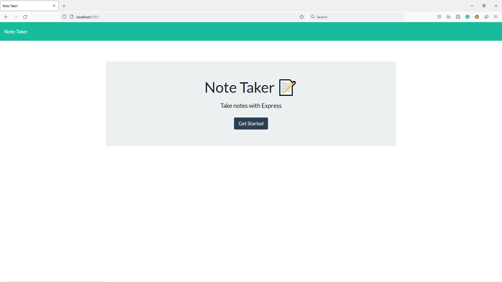
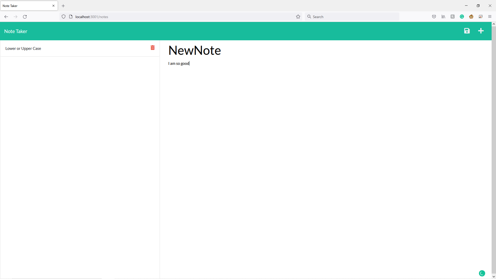
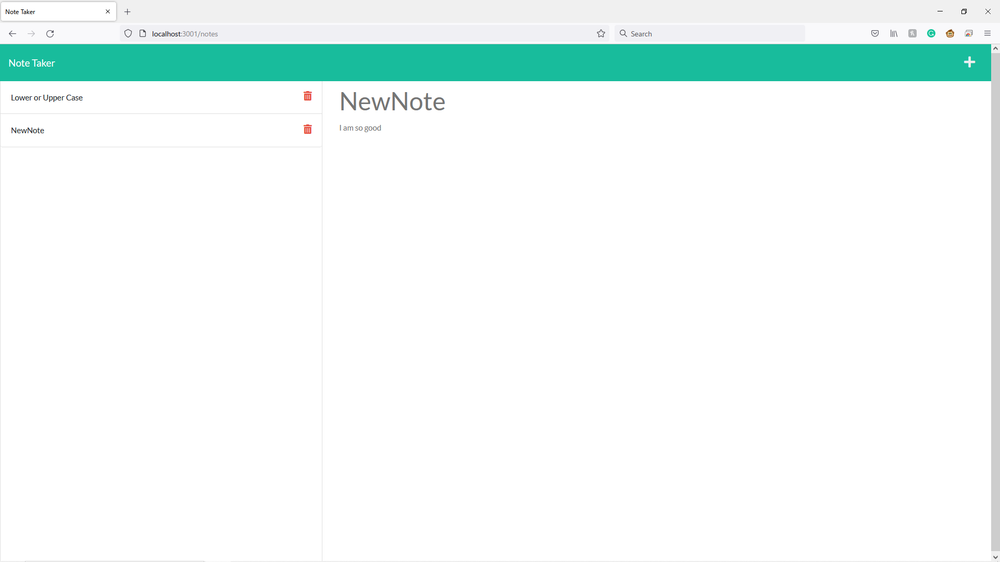

# Note Taker

## Table of Content: 
* [Deploy link](#Deploy-link)
* [Description](#Description)
* [Installation](#Installation)
* [User Guide](#User-Guide)
* [Third Party Package](#Third-party-package-used)
* [Contact](#Contact)

## Deploy Link
https://github.com/Aurorachama/

## Description 

This is a application allow users to write, save and display notes using HTML.

## Installation 
***This application relies on node.js as its run-time enviornment. Please install node.js before using this application***

***For information about node.js : [Node.js](https://nodejs.org/)***
* Clone this project using git clone <url> or Download ZIP, then use a command line to  run ``` npm i ``` to install necessary packages (express.js and nanoid)

## User Guide 

* Once installation is finished, user can type 
``` 
node index.js
```
or 
``` 
npm start
```
to run the code. 

* Then, the app will be deployed at http://localhost:3001 which would be the web interface for users

* After clicking the Get Started button on the homepage, users will be directed to the notes page

* In which, the user can type in the title and content of the note

* A Save button (floppy disk icon) would appear in the navigation bar, in which user can interact by clicking it to add note
```
The Save button would only appear if the title and content of the note are present
```
* Then, the saved note would appear at the left hand side, user can click on it to display that note
```
Keep in mind that the note would be displayed at the input field
```
* The Delete button (Red rubbish bin icon) is the button that users can interact to delete a specific note

* User can that select the Add button (plus icon) at the navigation bar to start adding a new note

## Third party package used
[Express.js](https://github.com/expressjs/express) <br>
[Nanoid](https://github.com/ai/nanoid)


## Screenshot
**Powershell is used to commence the application but other commend line works the same**


**Every question and the success message**


**The product and its path(inside the Output folder)**


### Contact 

Github: [Aurorachama](https://github.com/Aurorachama)
